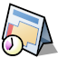
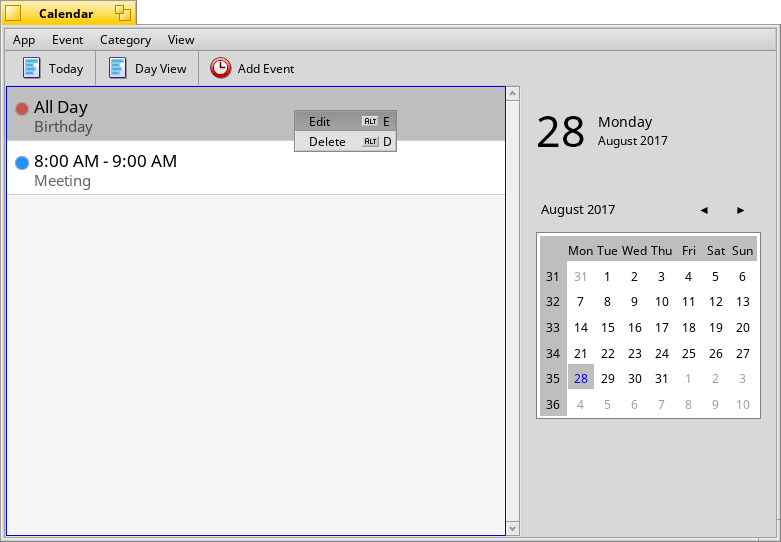
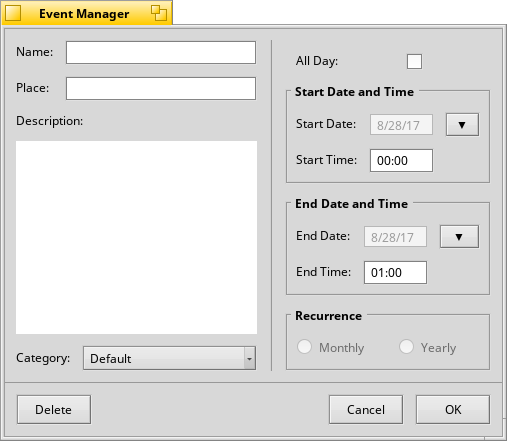
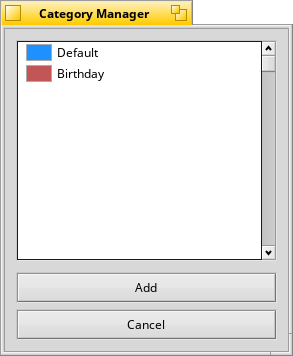
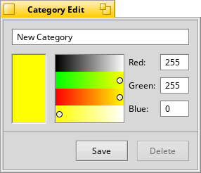
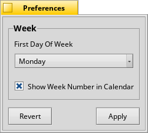
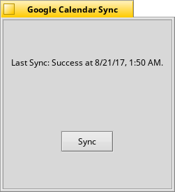
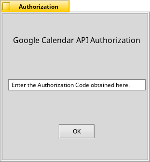

**Calendar**
for [Haiku](https://www.haiku-os.org/).

***

[About](https://www.haiku-os.org/blog/akshayagarwal007/2017-05-08_gsoc_2017_calendar_application/) | [Blog Posts](https://www.haiku-os.org/blog/akshayagarwal007/)

A native Calendar application for Haiku.

### Features

* Create, modify and delete events.
* Generate notifications for events.
* Day Calendar view.
* Event categorization.
* Set 'All day' long events.
* Fetching events from Google Calendar using Google Calendar API.
* SQLite backend for storing events.
* Setting preferences like 'First day of week',
'Display week number in Calendar'.
* App localization: DateTime strings are localised and updates with
locale preferences change but GUI string still needs to be localized.

**Main Window**

*The toolbar icons are just placeholder icons.*

* MenuBar
    * App
      * About: Shows about window.
      * Preferences: Opens app preferences window. 
      * Synchronize->Google Calendar: Opens Google Calendar sync window.
      * Quit: Closes the app.
    * Event
      * Add Event: Opens event manager.
      * Edit Event: Opens event manager in Edit mode for selected event.
      * Delete Event: Deletes selected event.
    * Category
      * Edit Categories: Shows 'Day View' as the main view in the main window.
      Currently it's of no use as the default view is 'Day View' itself and
      there is no other view(For e.g 'Month View', 'Agenda View').
    * View
      * Day View: Shows 'Day View'.
      * Today: Sets the calendar widget to the current system date and shows
      today's events in the day view. 
     
* ToolBar
  * Add Event: Opens Event Manager Window.
  * Day View: Shows 'Day View' as the main view in the main window. Currently
  it's of no use as the default view is 'Day View' itself and there is no other
  view.(For e.g 'Month View', 'Agenda View').
  * Today: Sets the calendar widget to the current system date and shows
  today's events in the day view. 

Double click on an individual event in the list will open the Event Manager in
edit mode. Right click on an individual event in the list will show the context
menu. 'Edit' will open the Event Manager in edit mode and the 'Delete' will
delete the event. A warning is shown so as to avoid accidental deleting of
events.

Day View shows the events belonging to the date selected in the Calendar Widget.
The color bubbles in event list items are the category indicator of the events.  

The big date header in the top right currently shows the current system date.

**Event Manager**

Event details like name, place, description can be filled here. Appropriate
category can be selected which is set to 'Default' category by default. An event
can be made an 'All Day' event i.e it continues for the entire day and has no
start/end time. Start/End date can be selected from the calendar pop-up which
pops up on pressing the ▼ button. The start/end time is a simple text control
where the time can be entered in HH:mm(24-hour format) and defaults to 00:00 in
case of bad data entered. In case it's opened in Edit mode the various fields
are filled with event specifics and delete button is enabled.

**Category Manager**

This manages event categories which can be assigned to events. It contains two
categories by default namely: 'Default' and 'Birthday'. The 'default' category
cannot be deleted but can be modified. Clicking on 'Add' opens the category edit
window. Selecting a category from the list opens the category edit window in
'edit mode'.

**Category Edit Window**

Category details: name and color can be filled here. Clicking on delete button
will delete the category if in edit mode. The color is the category indicator
which is displayed alongside the event name in the events list in main window.
Two categories cannot have the same name and color.

**Preference Window**

Currently it contains only two preferences:
* First Day of Week: Sets the first day of week in the calendar widget. It is
set based on the locale preferences by default.
* Show Week Number in Calendar: Displays week number in calendar widget.

**Google Calendar Sync Window:**

This displays the last Google calendar sync status: the time of last sync
attempt and whether the sync failed or succeeded. Clicking on 'Sync' fetches
events from Google Calendar and syncs them with the database. If clicked for the
first time it takes you through the authorization process. Key access for
storing/retrieving refresh token and next sync token is also required.
 
### Mentors

* [Scott McCreary](https://github.com/scottmc)
* [Kacper Kasper](https://github.com/KapiX)
