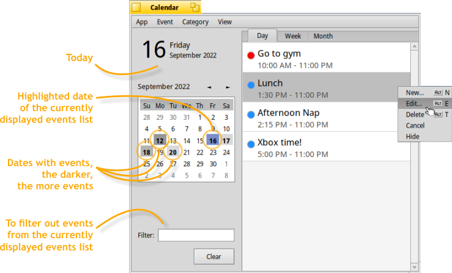

 **Calendar** for [Haiku](https://www.haiku-os.org/).

* * *

Calendar is a native Haiku application to manage your appointments.    
You can create, edit and delete events, and cancel or hide them, categorize events and show them in a day, week or month view.



Requirements
-------
To build Calendar you need some development libraries:

* sqlite3   -- ```$ pkgman install sqlite_devel```  (For 64 bit version of Haiku)
* sqlite3   -- ```$ pkgman install sqlite_x86_devel```  (For 32 bit version of Haiku)

Note
-------
Before invoking 'make' (for 32 bit version of Haiku), do a 'setarch x86' to change the build environment to use gcc11.


For more information, please see the [Calendar documentation](http://htmlpreview.github.io/?https://github.com/HaikuArchives/Calendar/master/documentation/Documentation.html).
